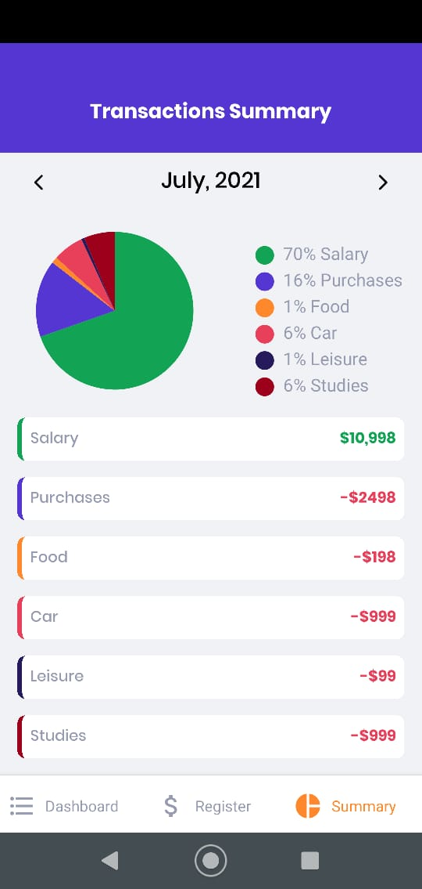

  

## GoFinances

<h4 align="center">
  GoFinances is a mobile app to manage personal finances.
</h4>

## Tecnologies used in this project

- [React Native](https://github.com/facebook/react-native)
- [Expo](https://github.com/expo/expo)
- [Reanimated 2](https://github.com/software-mansion/react-native-reanimated)
- [React Hook Form](https://github.com/react-hook-form/react-hook-form)
- [DateFns](https://github.com/date-fns/date-fns)
- [Styled Components](https://github.com/styled-components/styled-components)
- [React Native Bottom Sheet](https://github.com/gorhom/react-native-bottom-sheet)
- [React Native Chart Kit](https://github.com/indiespirit/react-native-chart-kit)

### Transaction list

### Register transaction

### Transaction summary

